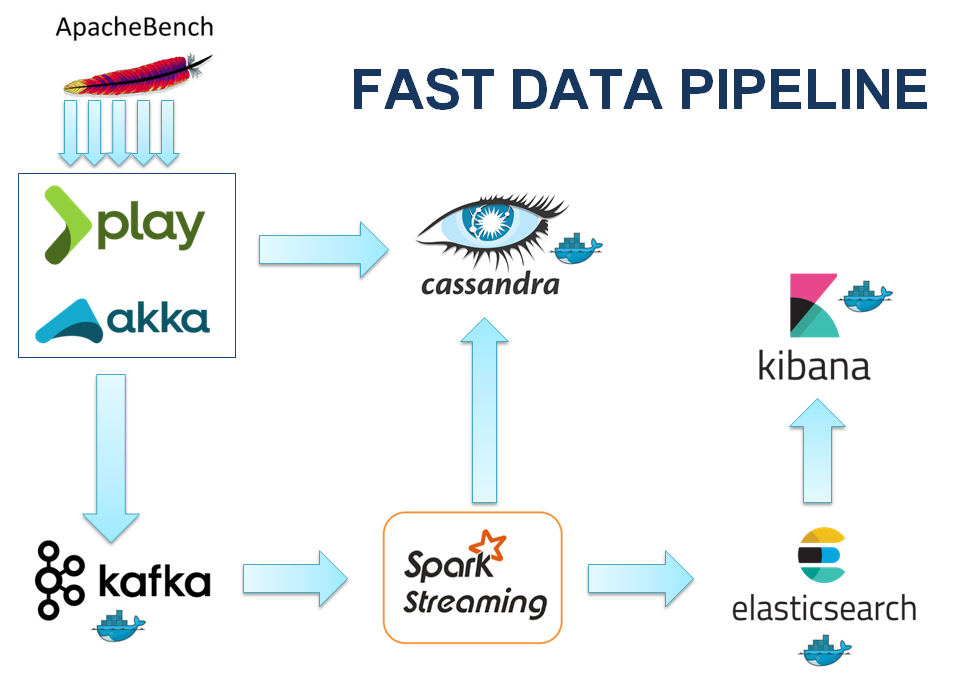

# Fast data pipeline 

The data pipeline designed in this project leverages the cutting edge fast data/reactive web solutions such as **Play framework, Akka actor, Kafka, Zookeeper, Spark streaming, Cassandra, Elasticsearch, Kibana & Docker containers**. The focus of this talk will be around spark streaming using kafka as data source and Elasticsearch and Cassandra as data sink.

Two type of data flow in this pipeline
  1. Application logs
  2. Event sourcing events
  
Spark streams data in real time from data backplane i.e. Kafka. The streamed data is transformed either to be indexed into Elasticsearch (application logs to be displayed in dashboard kibana) or to be saved in Cassandra (event sourcing data).

