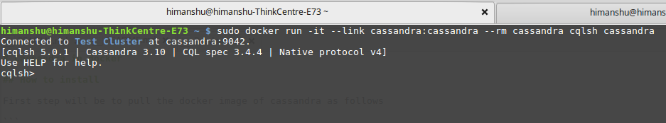

# Cassandra in docker

## How to install 

First step will be to pull the docker image of cassandra as follows

```
sudo docker pull cassandra
```

## How to run

```
sudo docker run --name cassandra -p 127.0.0.1:9042:9042 -p 127.0.0.1:9160:9160 -v /my/own/datadir:/var/lib/cassandra -d cassandra
```

`/my/own/datadir` is the path to directory of your machine where you want cassandra container to persist the data.


## How to test

The following command starts another Cassandra container instance and runs cqlsh (Cassandra Query Language Shell) against your original Cassandra container, allowing you to execute CQL statements against your database instance. 

```
sudo docker run -it --link cassandra:cassandra --rm cassandra cqlsh cassandra
```

So if you see the following output as a result that means your cassandra container is up & running:


