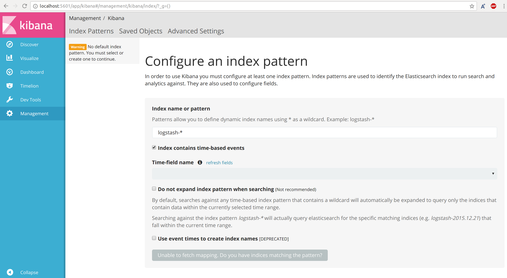

# Kibana in docker

## How to install 

First step will be to pull the docker image of kibana as follows

```
sudo docker pull kibana
```

## How to run

Run a Docker container (make sure elastic-search container is running), expose port 5601

```
sudo docker run -d --name kibana -p 5601:5601 -e ELASTICSEARCH_URL=http://localhost:9200 --net host kibana
```

## How to test

To test, point your browser port 5601 http://localhost:5601 and you should see the Kibana UI



## Output

Below are the screen captues of kibana `raw log query` and `log statistics & graphs` **dashboards** configured for this fast data application:


<br/>


