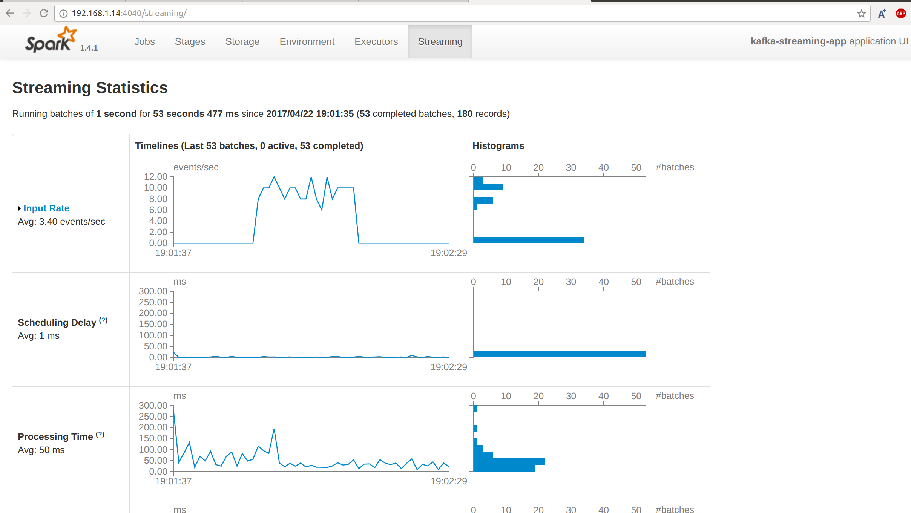

# Sparking streaming job to stream data from kafka topic

## How to run

Install sbt and run the following command on the root of this project

```
sbt run
```

## Spark UI

Spark UI helps a lot to moniter and get the insight of the running streaming job as shown below:


